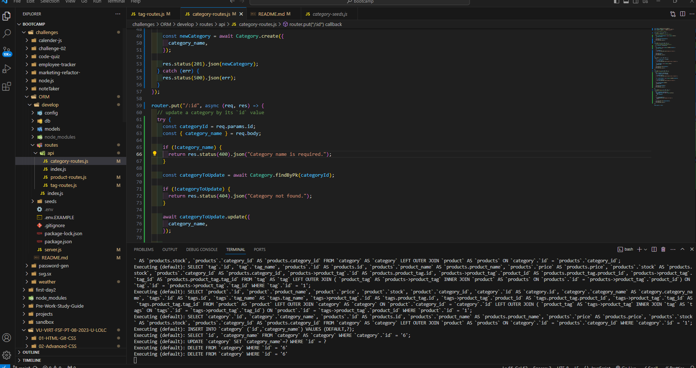

# ORM

# description:  used async await to get all the categories products and tags to populate that was the main thing that main thing that made the code work right

# picture:  

# links:

https://github.com/Clarky13F/ORM

https://drive.google.com/file/d/1M412q-SgbolHW1BYRsDCBQwCHq0D6mNJ/view